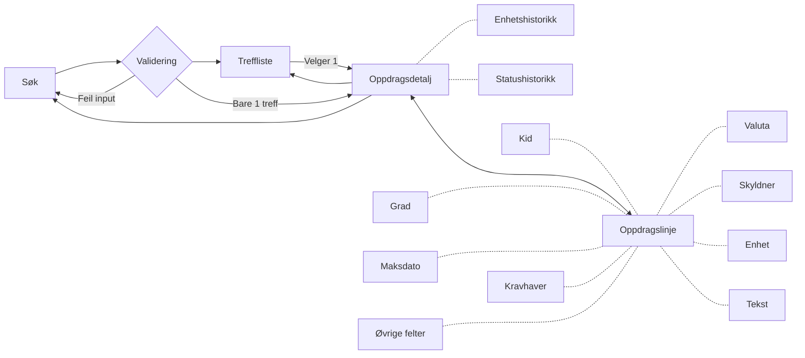
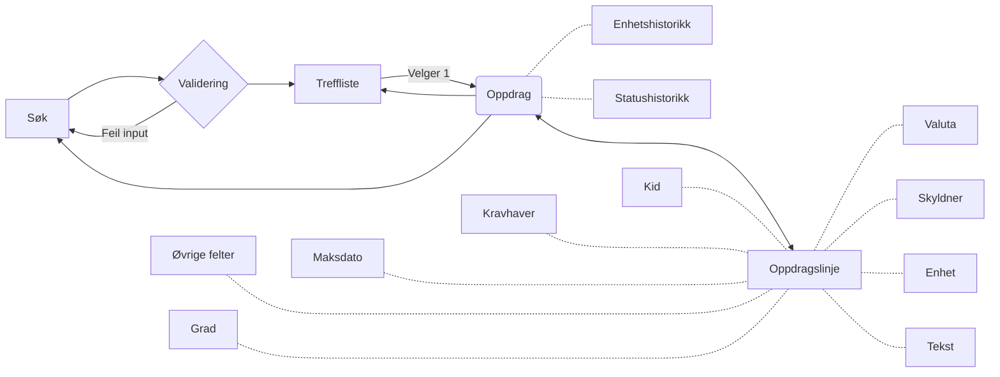
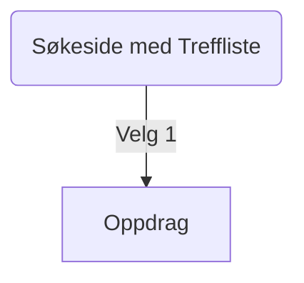
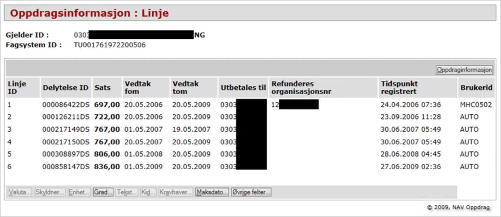

# Dokumentasjon(gammel løsning)

## Ifølge word-dokumentet

Det ligger et word-dokument på sikkert filområde.

```
X:\Fagområder\Systemforvaltning\Systemområde Økonomi\OB04 Oppdragssystemet\08_Systemdokumentasjon\11_Java\09_Oppdragsinfo").
```

Slik beskrives skjermbildet i det dokumentet:



Oppdragsinfo var en ubrukt funksjon som skulle vise noe fra en tabell som alltid har vært tom.

Gammelt bilde som ikke enkelt kan redigeres:


## Faktisk utprøving av skjermbildet



Stiplede linjer vil si at det er en popup.

Hvis det bare var 1 treff i søket vises en knapp i Oppdrag som det står "Oppdragsdetaljer" på, og man får
NullPointerException om man klikker på den.

## Nytt Oppdragsinformasjonskjermbilde



## Lister

Vi bruker [Aksels tabell](https://aksel.nav.no/komponenter/core/table#tabledemo-sortable),
innebygde sortable som erstatning for sorteringslenker,
og med innebygget pagination som erstatning for Forrige- og Neste-knapper.

## Popup

Mange av knappene i den gamle løsningen brukte knapper for å åpne popups for å vise forskjellig informasjon.
Vi kan bruke [Popover](https://aksel.nav.no/komponenter/core/popover) eller [Modal](https://aksel.nav.no/komponenter/core/modal)

## Navigering

I den gamle løsningen er det separate sider for visning av søk, treffliste, oppdrag og oppdragslinje,
med knapper for å navigere mellom dem.

## Komponenter i Oppdragsinfo

### Søk


Søket baserer seg på Faggruppe(nedtrekksmeny), Gjelder-ID, Fagsystem-ID og Dato FOM
Vi kan lene oss kraftig på [ORS sitt Posteringsøk](https://github.com/navikt/sokos-up-ors/blob/master/src/components/PosteringS%C3%B8kPanel.tsx)
men hvis vi kan validere med [Zod](https://zod.dev/) så kan det gi typesikkerhet i runtime som Typescript ikke har, med mindre kode.

Foretrekk BodyShort og BodyLong foran mye css og br-elementer

### Treffliste


### Oppdragsdetaljtabell


Knappene øverst til høyre for Statushistorikk og enhetshistorikk viste en popup.
Treffliste navigerte tilbake til Treffliste


### Oppdragslinjedetaljtabell



Knappene nederst er lenke til popuper:

