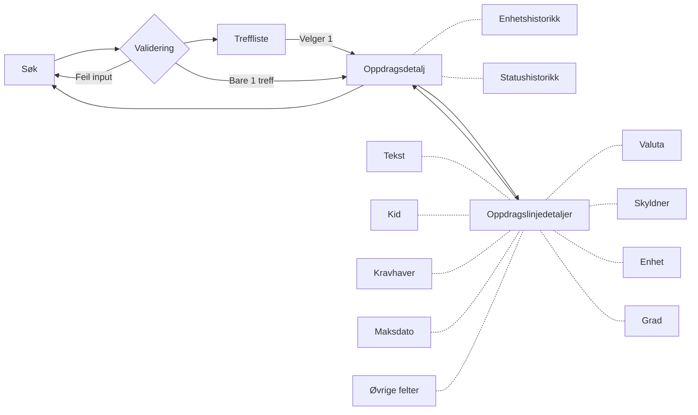
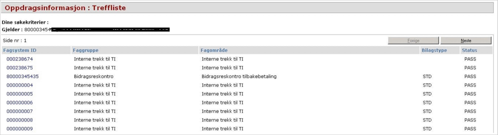
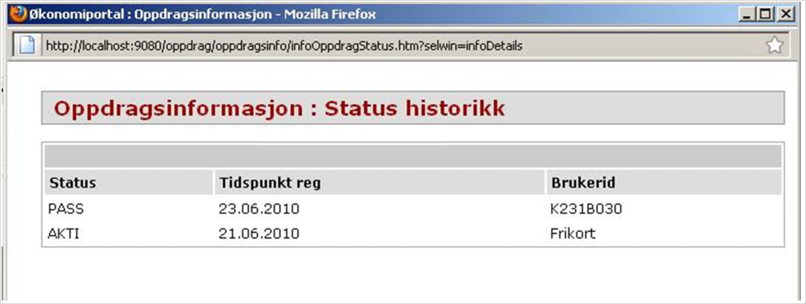
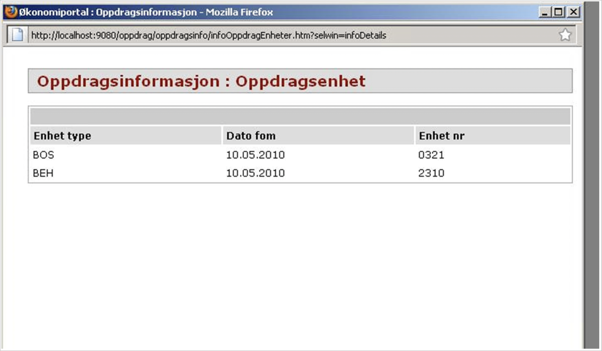
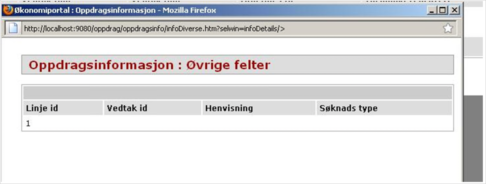

# Dokumentasjon(gammel løsning)

## Lister

Vi bruker [Aksels tabell](https://aksel.nav.no/komponenter/core/table#tabledemo-sortable), innebygde sortable som erstatning for sorteringslenker,
og med innebygget pagination som erstatning for Forrige- og Neste-knapper

## Popup

Mange av knappene i den gamle løsningen brukte knapper for å åpne popups for å vise forskjellig informasjon.
Vi kan bruke [Popover](https://aksel.nav.no/komponenter/core/popover) eller [Modal](https://aksel.nav.no/komponenter/core/modal)

## Navigering

I den gamle løsningen er det helt separate sider for visning av oppdrag og -linje, med knapper for å navigere mellom dem.

## Komponenter i Oppdragsinfo

### Søk

Søket baserer seg på Faggruppe(nedtrekksmeny), Gjelder-ID, Fagsystem-ID og Dato FOM
Vi kan lene oss kraftig på [ORS sitt Posteringsøk](https://github.com/navikt/sokos-up-ors/blob/master/src/components/PosteringS%C3%B8kPanel.tsx)
men hvis vi kan validere med [Zod](https://zod.dev/) så kan det gi mindre kode og typesikkerhet i runtime som Typescript ikke har.

Foretrekk BodyShort og BodyLong foran mye css og br-elementer

### Treffliste

### Oppdragsdetaljtabell

Her skal vi vise Statushistorikk, Enhetshistorikk, Statushistorikk for oppdragslinje, Attestantinfo, og Oppdragslinjedetaljer
Knappene øverst til høyre for Statushistorikk og enhetshistorikk viste en popup.

### Oppdragslinjedetaljtabell

Her skal vi vise Kravhaver, Kid, Tekst, Grad, Enhet, Skyldner, Valuta og Øvrige felter
Tabellen kan sorteres på de ulike verdiene. Det er mulig vi kan gjenbruke tabellen i sokos-up-ors.

Knappene nederst er lenke til popuper:

