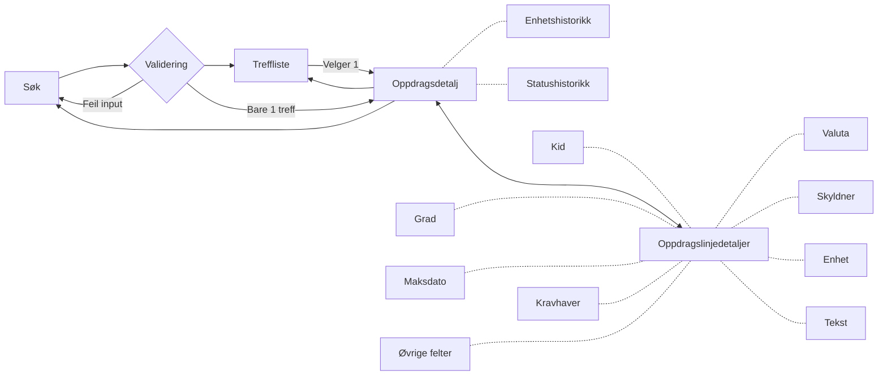
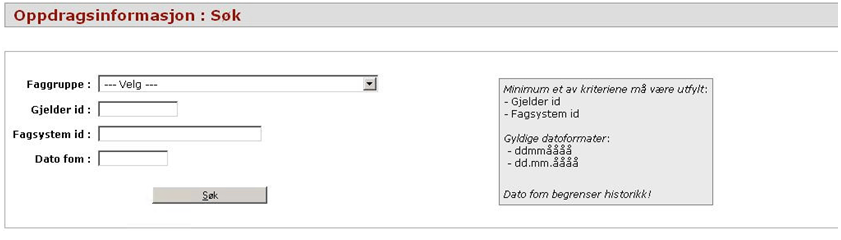

# Dokumentasjon(gammel løsning)

Stiplede linjer vil si at det er en popup

## Lister

Vi bruker [Aksels tabell](https://aksel.nav.no/komponenter/core/table#tabledemo-sortable),
innebygde sortable som erstatning for sorteringslenker,
og med innebygget pagination som erstatning for Forrige- og Neste-knapper.
Bare dette gjør den nye løsningen svært mye enklere enn den gamle.

NB! Det er også innebygget paginering i backend, slik ast vi slipper å hente ut mer data enn vi faktisk trenger for å
vise det saksbehandler kan se på skjermen.

## Popup

Mange av knappene i den gamle løsningen brukte knapper for å åpne popups for å vise forskjellig informasjon.
Vi kan bruke [Popover](https://aksel.nav.no/komponenter/core/popover) eller [Modal](https://aksel.nav.no/komponenter/core/modal)

## Navigering

I den gamle løsningen er det helt separate sider for visning av oppdrag og -linje, med knapper for å navigere mellom dem.

## Komponenter i Oppdragsinfo

### Søk

Søket baserer seg på Faggruppe(nedtrekksmeny), Gjelder-ID, Fagsystem-ID og Dato FOM
Vi kan lene oss kraftig på [ORS sitt Posteringsøk](https://github.com/navikt/sokos-up-ors/blob/master/src/components/PosteringS%C3%B8kPanel.tsx)
men hvis vi kan validere med [Zod](https://zod.dev/) så kan det gi typesikkerhet i runtime som Typescript ikke har, med mindre kode.

Foretrekk BodyShort og BodyLong foran mye css og br-elementer

### Treffliste

### Oppdragsdetaljtabell

Knappene øverst til høyre for Statushistorikk og enhetshistorikk viste en popup.
Treffliste navigerte tilbake til Treffliste

### Oppdragslinjedetaljtabell

Knappene nederst er lenke til popuper:

