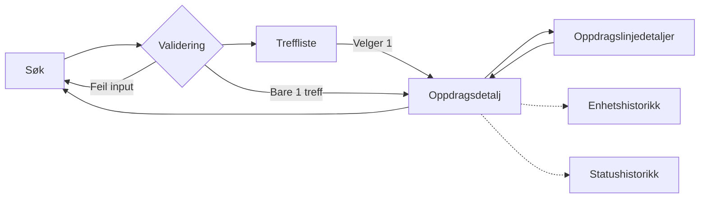

# sokos-up-oppdragsinfo

Brukes som utgangspunkt for å opprette nye mikrofrontends i Økonomiportalen.

# Kom i gang

1. Installere [Node.js](https://nodejs.dev/en/)
2. Installer [pnpm](https://pnpm.io/)
3. Installere dependencies `pnpm intall`
4. Start appen lokalt `pnpm run dev`
5. Appen nås på http://localhost:5173

# Henvendelser

Spørsmål knyttet til koden eller prosjektet kan stilles som issues her på Github.
Interne henvendelser kan sendes via Slack i kanalen #po-utbetaling.

# Dokumentasjon(gammel løsning)

# Lister

Vi bruker [Aksels tabell](https://aksel.nav.no/komponenter/core/table#tabledemo-sortable), sortable, og med pagination

# Popup

Vi bruker [Popover](https://aksel.nav.no/komponenter/core/popover)

# Komponenter i Oppdragsinfo

## Søk

Søket baserer seg på Faggruppe(nedtrekksmeny), Gjelder-ID, Fagsystem-ID og Dato FOM
Vi kan lene oss kraftig på [ORS](https://github.com/navikt/sokos-up-ors/blob/master/src/components/PosteringS%C3%B8kPanel.tsx)
men hvis vi kan validere med Zod så er nok det mer hensiktsmessig og kan gi mindre kode.

## Treffliste

## Oppdragsdetaljtabell

Her skal vi vise Statushistorikk, Enhetshistorikk, Statushistorikk for oppdragslinje, Attestantinfo, og Oppdragslinjedetaljer
Statushistorikk og enhetshistorikk var Popuper. Vi bruker Popover i første omgang.

## Oppdragslinjedetaljtabell

Her skal vi vise Kravhaver, Kid, Tekst, Grad, Enhet, Skyldner, Valuta og Øvrige felter
Tabellen kan sorteres på de ulike verdiene. Det er mulig vi kan gjenbruke tabellen i sokos-up-ors.
